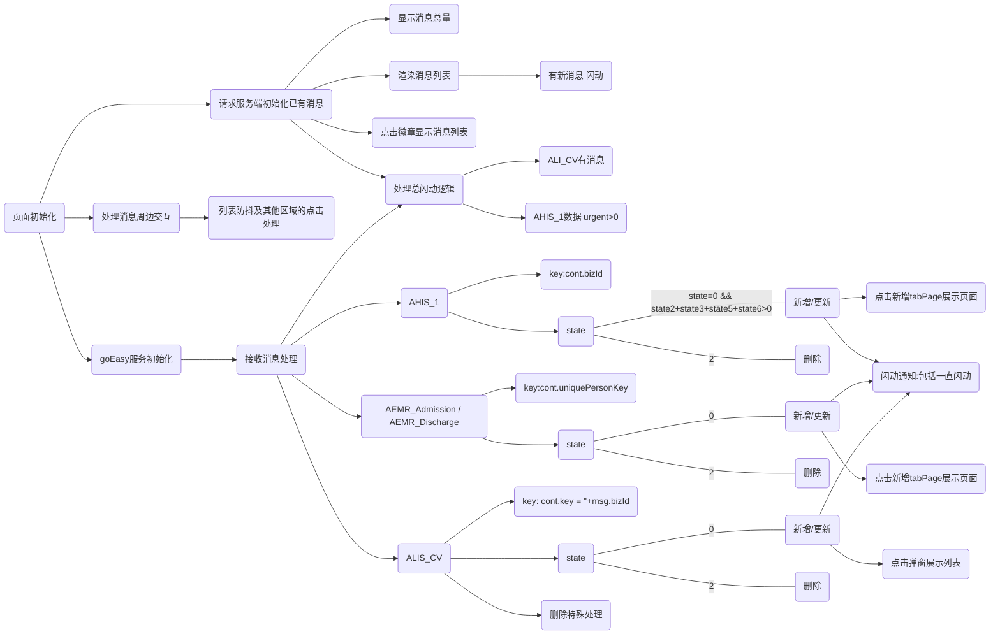

# 消息推送需求说明

## 消息种类：

- 医嘱 ( bizType : AHIS_1)
- 病历 (bizType : AEMR_Admission / AEMR_Discharge)
- 危急值 (bizType : ALIS_CV)
- 视光 (bizType : AVIS_SALES_MESSAGE)

### 数据集合 msgs

```javascript
  var msgs = {
    AHIS_1 : {
      type : 1,
      bizType : 'AHIS_1',
      desc : '医嘱',
      size : 0,
      data : []
    },
    AEMR_Admission : {// AEMR_Admission / AEMR_Discharge
      type : 2,
      bizType : "AEMR_Admission",
      desc : '病历',
      size : 0,
      data : {}
    },
    ALIS_CV : {
      type : 3,
      bizType : "ALIS_CV",
      desc : '危急值',
      size : 0,
      data : {}
    },
    AVIS_SALES_MESSAGE : {
        type : 4,
        bizType : "AVIS_SALES_MESSAGE",
        desc : '视光',
        size : 0,
        data : {}
    }
  };
```

## 消息处理总逻辑
1，初始化 从服务器拉取累计消息数据(`base+'/ui/sys/sysMessage/getMessagePush`) 展示并渲染显示

2, 建立 goEasy 消息推送服务，接收不同类消息数据，更新不同消息类型，做不同处理，消息分类处理函数 `IMsg.actionType` 

3, 存在或接收到新消息，消息区域需要反复闪动(现在是4次)

4,当前分类无消息，不显示对应分类 tab面板

5，一直闪动逻辑：
- 1 / `ALIS_CV` 危急值时要求总闪动
- 2 /  `AHIS_1`中数据(`urgent>0`)时总闪动 并 **直接展开消息列表**
- 3 / `ALIS_CV` 危急值时需要显示红色的 危 字

6， 消息列表满足： (消息被点击) || (停留超过500ms不被点击) || (非消息区域被点击) ，列表消失

7，消息点击事件：
- 1/ 危急值为弹窗显示详情 (添加class="li-t-3") ,
- 2/ 其他为打开具体tabPage页。
- 3/ (在院患者处理 || 住院医生站)，打开页面需要先关闭后再打开 tabPage

8，特殊处理
- 点击徽章，AEMR数据需要重新渲染，目的是重新计算消息时间间隔
- `ALIS_CV` 存在发送已删除消息情况，需忽略出来
- `AHIS_1` 删除消息会发送多条

## 消息处理实现流程

### 消息处理流程图


### 初始化函数
- `getDom` ： 根据根节点获取所有操作 Dom
- `initData` : 初始化从服务端获取数据并渲染，医嘱消息从单独的url请求(getInpOrderMsgPush)
- `goMsgInit` : 初始化goEasy，初始化接收消息处理
- `msgInlayout` ： 消息在布局中的显示和隐藏处理


### initData
- 请求 `base+'/ui/sys/sysMessage/getMessagePush` 获取数据
- 设置消息重量
- 处理消息，渲染消息
- 初始化 消息tab点击事件
- 处理 特殊的消息一直闪动

### goMsgInit
- 调用 `GEcontrol.init` 初始化 `goEasy`
- 消息接收处理函数 `receiveMsg`

### receiveMsg
- `JSON.stringify` 消息
- `mergeMsg` 处理当前获取消息并赋值给 `thisMsgData`
- 对 `thisMsgData` 做当前消息的 新增/更新/删除 处理
- 设置对应消息类的tab标题、内容、消息数显示
- 总闪动函数判断执行

### actionType
综合消息类处理集合函数
- 接收参数：( msgBox: msgs中对应的msg对象， msg: 消息内容， state ： 1 (新增或更新) / 0 (删除) )
- 返回 returnMsg : {cont：新增更新时为数据本身，删除时为需要删除的节点 ，state : 0(删除) / 1(新增) / 2(更新)}


### 其他处理函数说明
- `mergeMsg` ： 返回合并数据
- `reDomAemr` ： 重新渲染Aerm数据
- `renderKind` ： 渲染分类tab
- `removeKind` ： 检验是否需要移除某类整个tab(当无数据时移除)
- `renderItemsByType` ： 根据分类 渲染 每一项 消息 到 cont里的ul中
- `titleClick` ： 分类标题点击事件
- `itemClickOpenPop` ： 弹窗展示消息数据
- `setBadgeState` ： 设置badge状态和值
- 
- `flashMsg` ： 如果有新消息，闪动消息
- `alwaysFlashMsg` ： (ALIS_CV 危急值) || ( AHIS_1中数据(urgent>0)) 时总闪动 ,
alisCvRole && hasWei && (me.receiveMsgType=='ALIS_CV' || me.receiveMsgType=='init') // 检验科用户 && 有危急值 && (这次推过来的是危急值 || 初始状态) 弹窗显示危急值

- `popCvInfo` ： 弹窗显示危急值信息：先清除cvTimer，如果危急值消息条数大于0，则弹窗，关闭弹窗，如果是检验科用户重新开启 cvTimer
- `clearCVTimer`: 清除危急值倒计时
- `runCvTimer`: 开启危急值倒计时

- `msgBoxShow` ： 消息盒子 下拉显示
- `msgBoxHide` ： 消息盒子 下拉隐藏
- `msgBoxAutoHide` ： 无反馈，autoHide.time毫秒后自动关闭msgbox


### 辅助处理
- `countEndTime` : 返回时间间隔


